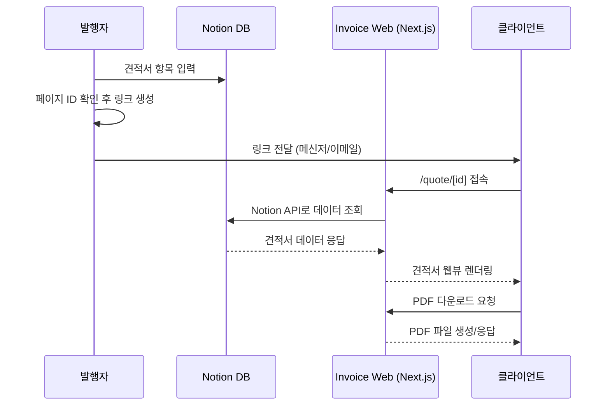
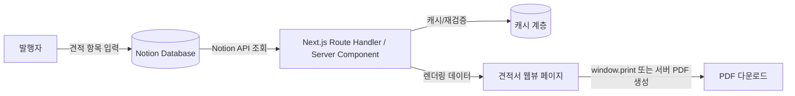

# PRD — Invoice Web (노션 연동 견적서 웹뷰 & PDF 다운로드 MVP)

- 서비스명: Invoice Web
- 한 줄 설명: 노션(Notion)에 입력한 견적서 데이터를 클라이언트가 별도 로그인 없이 웹 링크로 확인하고, 필요시 PDF로 다운로드할 수 있는 서비스

## 1. 문제 정의 및 목표

### 현재 견적서 공유 프로세스의 문제점 (가정)

- 견적서를 한글/엑셀/PDF로 만들어 이메일이나 메신저로 개별 첨부 발송한다. 항목이 바뀌면 파일을 다시 만들어 재발송해야 한다.
- 클라이언트가 파일을 열어보려면 별도 프로그램(한글, 엑셀 뷰어 등)이 필요하거나, 모바일에서 첨부파일을 확인하기 번거롭다.
- 발행자가 견적 항목/단가를 관리하는 곳(노션, 스프레드시트)과 실제 발송하는 문서(첨부파일)가 분리되어 있어 이중 작업이 발생한다.

### 이 MVP로 해결하려는 핵심 문제

1. 발행자가 이미 쓰고 있는 노션 데이터베이스에 견적 항목만 입력하면, 별도의 문서 작업 없이 클라이언트에게 공유 가능한 웹 링크가 생긴다.
2. 클라이언트는 로그인이나 별도 프로그램 설치 없이 브라우저에서 견적서를 확인하고, 필요하면 PDF로 저장할 수 있다.

### 성공 지표

| 지표                  | 정의                                                          | MVP 목표(가설)                      |
| --------------------- | ------------------------------------------------------------- | ----------------------------------- |
| 링크 조회율           | 발행된 견적서 링크 중 1회 이상 열람된 비율                    | 결정 필요 (초기 데이터 없음)        |
| PDF 다운로드율        | 웹뷰 조회 대비 PDF 다운로드 클릭 비율                         | 결정 필요                           |
| 발행자 작성 소요 시간 | 노션 입력 완료 후 공유 가능한 링크가 생성되기까지 걸리는 시간 | 5분 이내 (수동 문서 작업 대비 단축) |
| 페이지 정상 렌더링율  | 견적서 조회 요청 중 에러 없이 렌더링된 비율                   | 99% 이상                            |

## 2. 범위 정의 (In Scope / Out of Scope)

### In Scope (MVP 포함 기능)

- 노션 데이터베이스에서 견적서 항목 데이터를 읽어오는 연동
- 견적서 상세를 보여주는 공개 웹뷰 페이지 (`/quote/[id]` 형태)
- 웹뷰 화면을 PDF로 다운로드하는 기능
- 견적서 데이터가 없거나 잘못된 링크에 대한 에러/빈 상태 처리
- 라이트/다크 모드 대응 (리포지토리 기본 셸이 이미 제공)

### Out of Scope (제외 기능 및 이유)

| 제외 기능                             | 제외 이유                                                                                                                                   |
| ------------------------------------- | ------------------------------------------------------------------------------------------------------------------------------------------- |
| 결제 연동                             | MVP는 "확인 및 공유"까지가 목표이며, 결제는 별도 요구사항 검증이 필요해 후속 단계로 미룸                                                    |
| 다국어(i18n)                          | 초기 타깃이 국내 클라이언트로 가정되며, 다국어는 번역 리소스 관리 비용이 커 MVP 범위 밖                                                     |
| 견적 승인/전자서명                    | 법적 효력을 갖는 서명 기능은 별도 보안·감사 요구사항이 필요해 MVP에서 제외                                                                  |
| 알림톡/이메일 자동 발송               | 링크 공유는 발행자가 수동으로 전달하는 것으로 가정. 자동 발송은 발송 채널(카카오 알림톡 API, 이메일 서비스) 연동 비용이 커 후속 단계로 미룸 |
| 발행자용 관리자 대시보드(로그인 기반) | 데이터 입력/관리는 노션이 이미 담당하므로, 별도 관리자 UI를 만들지 않음                                                                     |
| 다중 통화 지원                        | 원화(KRW) 단일 통화로 가정. 결정 필요 시 재검토                                                                                             |

## 3. 사용자 시나리오 (User Flow)

### 발행자: 노션 입력 → 웹 링크 생성/공유

1. 발행자가 노션 데이터베이스에 새 견적서 항목(품목, 수량, 단가, 클라이언트 정보 등)을 입력한다.
2. 발행자가 노션 페이지 ID(또는 페이지 URL)를 확인한다.
3. 발행자가 `https://[서비스 도메인]/quote/[페이지ID]` 형태의 링크를 생성한다. (MVP에서는 노션 페이지 ID를 그대로 URL 파라미터로 사용하는 것을 기본안으로 가정 — 접근 제어 방식은 4장에서 별도 결정)
4. 발행자가 생성된 링크를 클라이언트에게 메신저/이메일 등으로 직접 전달한다.

### 클라이언트: 링크 접속 → 웹 확인 → PDF 다운로드

1. 클라이언트가 전달받은 링크를 클릭해 브라우저에서 접속한다.
2. 서버가 해당 ID로 노션 API를 조회해 견적서 데이터를 렌더링한다.
3. 클라이언트가 웹 화면에서 품목/수량/단가/합계 등 견적 내용을 확인한다.
4. 클라이언트가 "PDF 다운로드" 버튼을 클릭한다.
5. 브라우저가 현재 화면을 PDF로 변환해 다운로드한다.

## 4. 핵심 기능 명세

### 노션 데이터 연동

Notion 데이터베이스 프로퍼티 스키마 (테스트 DB 실측 기준 확정, D-03/D-04/D-06):

**`invoices` DB** (견적서, 메인)

| 프로퍼티명   | 타입(Notion) | 설명                                                                        |
| ------------ | ------------ | --------------------------------------------------------------------------- |
| 견적서 번호  | Title        | 견적서 식별자(제목)                                                         |
| 클라이언트명 | Rich Text    | 수신 클라이언트 이름/회사명                                                 |
| 항목         | Relation     | `items` DB(하위)로 연결되는 라인 아이템                                     |
| 총 금액      | Number(원)   | 발행자가 입력하는 합계 금액. 라인 아이템 합과의 검산 규칙은 별도 결정(D-05) |
| 발행일       | Date         | 견적서 발행일                                                               |
| 유효기간     | Date         | 견적서 유효 기한                                                            |
| 상태         | Status       | 옵션: 대기/거절/승인 — **`승인`만 웹뷰 노출**                               |

**`items` DB** (라인 아이템, `invoices`의 하위 Relation)

| 프로퍼티명 | 타입(Notion)           | 설명                             |
| ---------- | ---------------------- | -------------------------------- |
| 항목명     | Title                  | 품목명                           |
| 수량       | Number                 | 수량                             |
| 단가       | Number(원)             | 단가                             |
| 금액       | Formula(`수량 * 단가`) | Notion이 자동 계산하는 라인 합계 |

공급자(발행자) 정보 프로퍼티는 테스트 DB에 존재하지 않아 **MVP 범위에서 제외**한다(2026-08-22 확정).

### 견적서 웹뷰

- 라우팅: `PageProps<"/quote/[id]">`를 사용하는 동적 라우트(`src/app/quote/[id]/page.tsx`)로 구현. `params`는 Promise이므로 `await`으로 해석한다.
- 표시 항목: 견적서 번호, 발행일, 유효기간, 클라이언트 정보, 항목별 품목·수량·단가·소계, 합계 금액
- 반응형: 모바일에서 첨부파일 없이 바로 열람 가능해야 하므로 모바일 우선 반응형 레이아웃 필수
- UI 구현은 리포지토리 컴포넌트 계층(Primitives → Composite Blocks)을 따르며, `src/components/ui/*`는 `npx shadcn@latest add`로만 추가한다.

### PDF 다운로드 — 생성 방식 후보 비교

| 방식                                                           | 설명                                                      | 장점                                              | 단점                                                                               |
| -------------------------------------------------------------- | --------------------------------------------------------- | ------------------------------------------------- | ---------------------------------------------------------------------------------- |
| 브라우저 인쇄 API (`window.print()` + `@media print` CSS)      | 클라이언트 브라우저의 인쇄 기능을 PDF 저장으로 유도       | 서버 비용 없음, 구현 단순, 배포 후 즉시 사용 가능 | 브라우저/OS별 PDF 저장 UX가 다름, 정밀한 페이지 레이아웃 제어가 어려움             |
| 서버사이드 HTML-to-PDF (예: headless Chromium 기반 라이브러리) | 서버에서 동일 페이지를 렌더링해 PDF 바이너리 생성 후 응답 | 일관된 출력물 보장, 다운로드 버튼 클릭만으로 완결 | 서버리스 환경에서 헤드리스 브라우저 구동 비용/콜드스타트 이슈, 배포 환경 제약 가능 |
| 외부 PDF 생성 API 연동                                         | 타사 SaaS API에 HTML/데이터를 보내 PDF를 받음             | 인프라 관리 부담 없음                             | 외부 서비스 비용 및 요청 데이터 외부 전송에 따른 보안 검토 필요                    |

**MVP 선택(제안): 브라우저 인쇄 API 방식.** 별도 서버 인프라나 외부 비용 없이 가장 빠르게 구현 가능하고, 견적서처럼 텍스트/표 위주 문서는 `@media print` CSS로 충분히 정돈된 출력이 가능하기 때문. 다운로드 결과물의 일관성이 중요해지면 2단계에서 서버사이드 렌더링으로 전환을 검토한다. (결정 필요: 최종 방식 확정)

### 접근 제어

- 옵션 A: 완전 공개 링크(노션 페이지 ID를 그대로 URL에 사용) — 구현 단순하지만 ID가 유출/추측되면 누구나 열람 가능
- 옵션 B: 별도의 추측 불가능한 랜덤 토큰을 발급해 ID 대신 사용 — 최소한의 보안 강화, 추가 매핑 저장소 필요 없이 UUID 기반으로도 구현 가능
- 옵션 C: 만료 기한이 있는 서명된 링크(토큰 + 유효기간 검증)

**MVP 선택(제안): 옵션 B (랜덤 토큰 기반 공개 링크).** 로그인 없는 접근성을 유지하면서 최소한의 추측 방지를 확보. 만료/서명 로직(옵션 C)은 견적서 자체에 유효기간 데이터가 있으므로 웹뷰에서 "만료됨" 안내로 대체 가능. (결정 필요: 최종 보안 수준 확정)

## 5. 데이터 모델 및 연동 구조

- 데이터 흐름: 클라이언트 요청 → Server Component에서 Notion API 호출 → 데이터 가공 → 페이지 렌더링
- 캐싱/재검증 전략: Next.js의 `fetch` 캐싱 및 revalidate 옵션을 활용한 ISR(정기 재검증) 방식을 기본으로 하고, 발행자가 노션 항목을 수정한 직후 즉시 반영이 필요한 경우 on-demand revalidation(웹훅 또는 수동 트리거) 도입 여부는 결정 필요
- 에러 상황 처리
  - 노션 페이지가 삭제되었거나 비공개로 전환된 경우: "견적서를 찾을 수 없습니다" 안내 화면 표시
  - Notion API 호출 실패(레이트 리밋, 네트워크 오류): 재시도 후 실패 시 에러 안내 화면 표시, 서버 로그 기록
  - 필수 프로퍼티 누락: 누락 항목은 빈 값으로 표시하되 합계 계산에 영향을 주는 필드 누락 시 에러 처리 (결정 필요: 구체적 검증 규칙)

## 6. 비기능 요구사항

### 성능

| 항목                               | 목표(가설)                                                 |
| ---------------------------------- | ---------------------------------------------------------- |
| 초기 웹뷰 로딩(TTFB~렌더링 완료)   | 2초 이내                                                   |
| PDF 생성/다운로드 트리거 소요 시간 | 브라우저 인쇄 방식 기준 즉시(사용자 인쇄창 호출 시점 기준) |

### 보안

- 공개 링크는 추측 불가능한 랜덤 토큰을 사용한다 (4장 참고).
- 견적서에 포함된 민감정보(단가, 클라이언트 연락처 등)는 링크를 아는 사람에게만 노출되며, 검색엔진 색인은 차단한다 (`robots` 메타 태그 또는 `noindex` 설정).
- Notion API 키 등 인증 정보는 서버 환경변수로만 관리하고 클라이언트에 노출하지 않는다.

### 접근성 및 다국어

- 다국어는 Out of Scope (2장 참고).
- 접근성: 시맨틱 마크업과 명도 대비를 준수하는 수준으로 기본 대응하며, 별도 접근성 심화 요구사항은 결정 필요.

## 7. 화면 정의 (Screens)

| 페이지            | 경로                   | 핵심 컴포넌트                                                           | 상태 처리                                                                                        |
| ----------------- | ---------------------- | ----------------------------------------------------------------------- | ------------------------------------------------------------------------------------------------ |
| 견적서 상세(웹뷰) | `/quote/[id]`          | 견적서 헤더(클라이언트 정보), 항목 테이블, 합계 영역, PDF 다운로드 버튼 | 로딩: 스켈레톤 UI / 에러: "견적서를 찾을 수 없습니다" 안내 + 홈 링크 / 빈 데이터: 항목 없음 안내 |
| 홈/랜딩 (선택)    | `/`                    | 서비스 소개, 사용 안내                                                  | 결정 필요 — MVP에 랜딩 페이지 포함 여부                                                          |
| 404               | 기본 Next.js not-found | 안내 문구                                                               | 정적                                                                                             |

## 8. 마일스톤 및 일정 제안

| 단계                   | 범위                                                               | 완료 기준(DoD)                                                                      |
| ---------------------- | ------------------------------------------------------------------ | ----------------------------------------------------------------------------------- |
| 1단계 — 웹뷰 우선      | Notion API 연동, `/quote/[id]` 페이지 렌더링, 로딩/에러 상태 처리  | 실제 노션 데이터베이스의 견적서 1건을 링크로 열람 가능                              |
| 2단계 — PDF 다운로드   | 브라우저 인쇄 기반 PDF 다운로드 버튼 및 `@media print` 스타일 적용 | 웹뷰에서 다운로드한 PDF가 항목/합계 누락 없이 출력됨                                |
| 3단계 — 접근 제어 강화 | 랜덤 토큰 기반 링크 발급, 만료 견적서 안내 처리                    | 임의의 URL 추측 접근 시 견적서 노출되지 않음, 유효기간 지난 견적서에 만료 안내 표시 |

## 9. 리스크 및 오픈 이슈

### 기술적 리스크

- Notion API rate limit: 조회량이 늘어날 경우 API 호출 제한에 걸릴 수 있음 → 캐싱 전략(5장)으로 완화 필요
- PDF 렌더링 품질: 브라우저 인쇄 방식은 브라우저/OS별로 출력 여백·줄바꿈이 달라질 수 있음 → 2단계 이후 서버사이드 렌더링 전환 검토
- Notion 데이터베이스 스키마 변경: 발행자가 프로퍼티명을 임의로 바꾸면 연동이 깨질 수 있음 → 스키마 검증/에러 안내 필요

### 의사결정이 필요한 항목 목록

- [ ] 성공 지표별 구체적 목표 수치 (1장)
- [x] 노션 데이터베이스 실제 프로퍼티 스키마 확정 (4장) — 테스트 DB 실측 기준 확정, 2026-08-22
- [x] 항목(품목/수량/단가) 데이터를 별도 하위 DB로 관리할지, 단일 텍스트/JSON 필드로 관리할지 (4장) — `items` Relation DB로 확정
- [x] PDF 생성 방식 최종 확정 — 브라우저 인쇄 vs 서버사이드 렌더링 (4장) — 브라우저 인쇄로 확정
- [ ] 접근 제어 수준 최종 확정 — 완전 공개 vs 랜덤 토큰 vs 만료 서명 링크 (4장)
- [ ] on-demand revalidation(노션 수정 즉시 반영) 도입 여부 (5장)
- [x] 다중 통화 지원 여부 (2장) — KRW 단일 통화로 확정
- [x] 랜딩 페이지 포함 여부 (7장) — 현재 구현 유지로 확정
- [x] 배포 환경(Vercel 등) 및 이에 따른 PDF 생성 방식 제약 확인 — Vercel 후보로 확정
